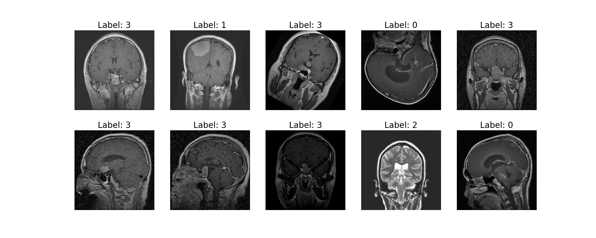
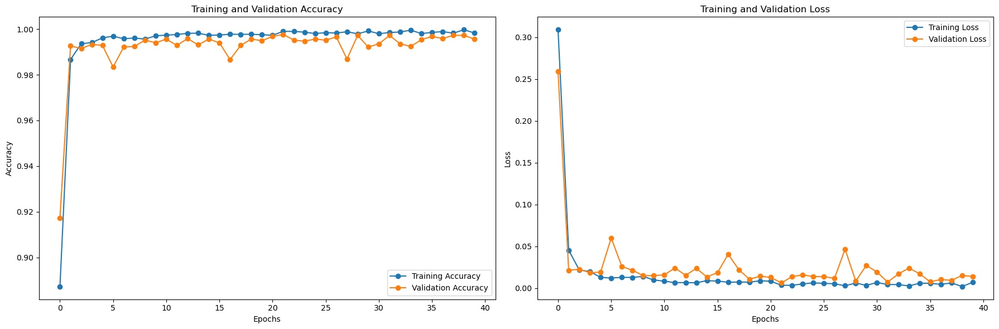
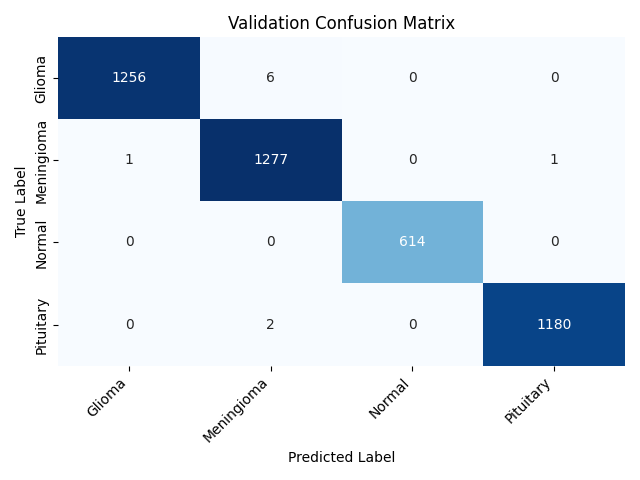
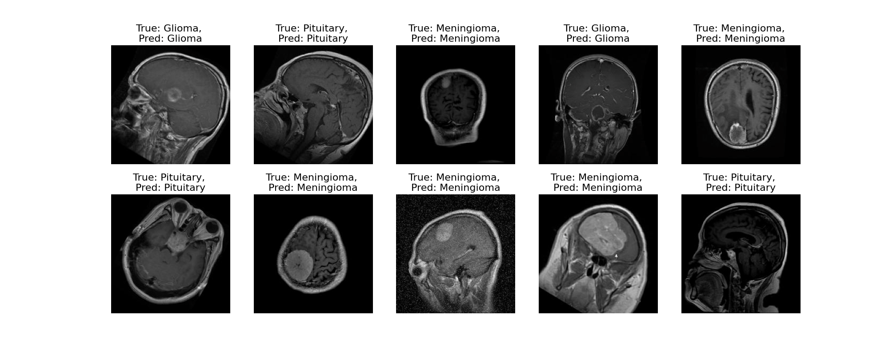
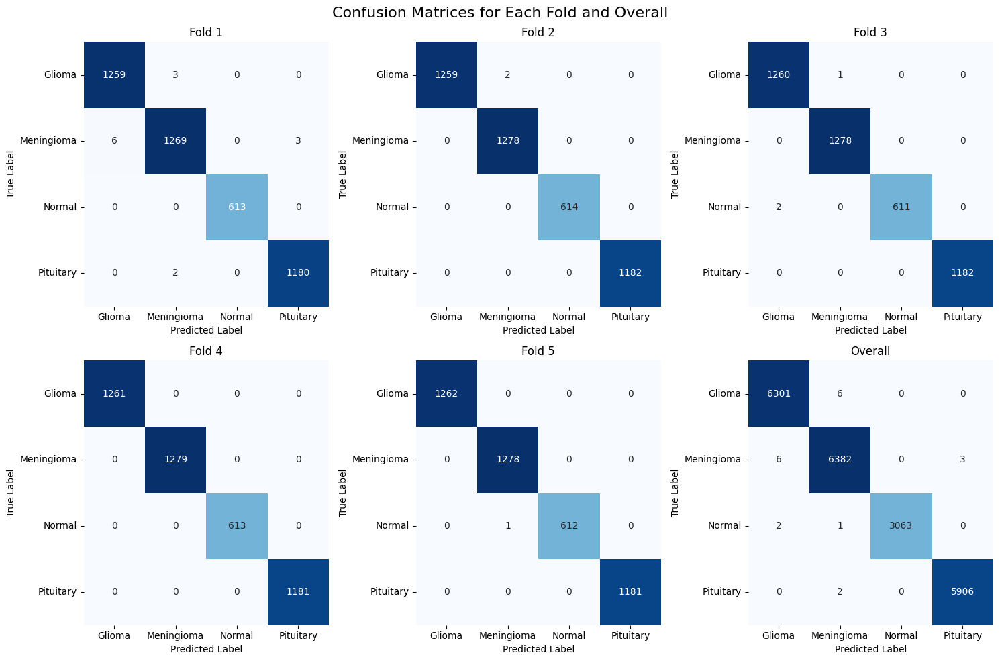

# Brain Tumor Classification

- This repository contains a complete project on Brain Tumor Classification, achieving an impressive accuracy of 99.77%

## Image Directory Setting Example

```
Image Folder/
├── Class 1/
│   └── Image1.jpg
│   └── ...
└── Class 2/
    └── Image1.jpg
    └── ...
```

## Brain Tumor Image Label Encoding
## ---------------------------------
```
Original Label : Glioma         Encoded Label: 0
Original Label : Meningioma     Encoded Label: 1
Original Label : Normal         Encoded Label: 2
Original Label : Pituitary      Encoded Label: 3
```
## Encoded Label Images


## Single Run Training Results

### Training and Validation Accuracy and Loss Graph


### Model Performance Score
```
Accuracy: 0.997
Precision: 0.9977
Recall: 0.9977
F1-score: 0.9977
```
### Confusion Matrix


### Model Prediction Results


## Cross Validation Results

- In Cross Validation Process Stratified 5-Fold Cross Validation Technique is Used.

### Cross Validation Report
```
Results by Fold:

| Fold | Train Loss | Train Accuracy | Val Loss | Val Accuracy |
|------|------------|----------------|----------|--------------|
| 1    | 0.003360   | 0.999192       | 0.012906 | 0.996770     |
| 2    | 0.003561   | 0.999077       | 0.003349 | 0.999539     |
| 3    | 0.001827   | 0.999250       | 0.003709 | 0.999308     |
| 4    | 0.000371   | 0.999885       | 0.000191 | 1.000000     |
| 5    | 0.001378   | 0.999596       | 0.001063 | 0.999769     |

Overall Classification Report:

| Class      	| precision  | recall | f1-score | support |
|---------------|------------|--------|----------|---------|
| Glioma     	| 1.00       | 1.00   | 1.00     | 6307    |
| Meningioma 	| 1.00       | 1.00   | 1.00     | 6391    |
| Normal     	| 1.00       | 1.00   | 1.00     | 3066    |
| Pituitary  	| 1.00       | 1.00   | 1.00     | 5908    |

| accuracy   	|            |        | 1.00     | 21672   |
| macro avg  	| 1.00       | 1.00   | 1.00     | 21672   |
| weighted avg 	| 1.00       | 1.00   | 1.00     | 21672   |

Cross-Validation Table:

Accuracy

| Class    | Fold 1 | Fold 2 | Fold 3 | Fold 4 | Fold 5 | μ   | σ²  |
|----------|--------|--------|--------|--------|--------|-----|-----|
|Glioma    | 1.00   | 1.00   | 1.00   | 1.00   | 1.00   | 1.00| 0.00|
|Meningioma| 1.00   | 1.00   | 1.00   | 1.00   | 1.00   | 1.00| 0.00|
|Normal    | 1.00   | 1.00   | 1.00   | 1.00   | 1.00   | 1.00| 0.00|
|Pituitary | 1.00   | 1.00   | 1.00   | 1.00   | 1.00   | 1.00| 0.00|

Precision

| Class    | Fold 1 | Fold 2 | Fold 3 | Fold 4 | Fold 5 | μ   | σ²  |
|----------|--------|--------|--------|--------|--------|-----|-----|
|Glioma    | 1.00   | 1.00   | 1.00   | 1.00   | 1.00   | 1.00| 0.00|
|Meningioma| 1.00   | 1.00   | 1.00   | 1.00   | 1.00   | 1.00| 0.00|
|Normal    | 1.00   | 1.00   | 1.00   | 1.00   | 1.00   | 1.00| 0.00|
|Pituitary | 1.00   | 1.00   | 1.00   | 1.00   | 1.00   | 1.00| 0.00|

Recall

| Class    | Fold 1 | Fold 2 | Fold 3 | Fold 4 | Fold 5 | μ   | σ²  |
|----------|--------|--------|--------|--------|--------|-----|-----|
|Glioma    | 1.00   | 1.00   | 1.00   | 1.00   | 1.00   | 1.00| 0.00|
|Meningioma| 0.99   | 1.00   | 1.00   | 1.00   | 1.00   | 1.00| 0.00|
|Normal    | 1.00   | 1.00   | 1.00   | 1.00   | 1.00   | 1.00| 0.00|
|Pituitary | 1.00   | 1.00   | 1.00   | 1.00   | 1.00   | 1.00| 0.00|

F1-Score

| Class    | Fold 1 | Fold 2 | Fold 3 | Fold 4 | Fold 5 | μ   | σ²  |
|----------|--------|--------|--------|--------|--------|-----|-----|
|Glioma    | 1.00   | 1.00   | 1.00   | 1.00   | 1.00   | 1.00| 0.00|
|Meningioma| 0.99   | 1.00   | 1.00   | 1.00   | 1.00   | 1.00| 0.00|
|Normal    | 1.00   | 1.00   | 1.00   | 1.00   | 1.00   | 1.00| 0.00|
|Pituitary | 1.00   | 1.00   | 1.00   | 1.00   | 1.00   | 1.00| 0.00|
```

### Cross Validation Confusion Metrics

